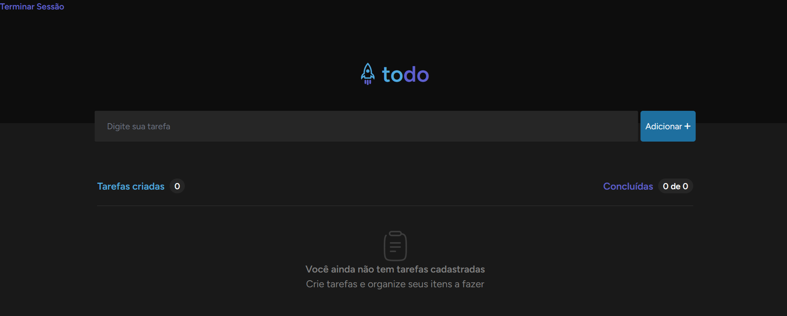
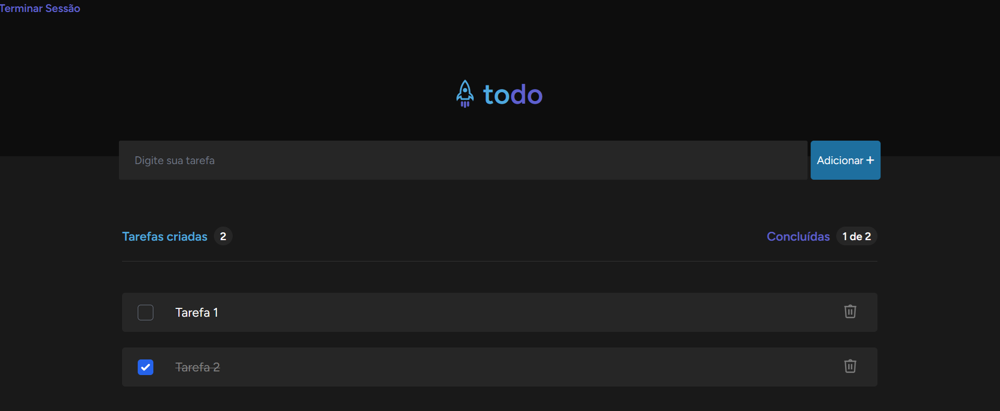

## 📝 To-Do List com Laravel 

Este é um projeto simples de To-Do List desenvolvido com Laravel, permitindo cadastrar, visualizar e excluir tarefas em uma única página. O sistema também conta com autenticação de usuários via Laravel Breeze, permitindo login e cadastro de contas.

#### 🚀  Tecnologias Utilizadas

- Laravel 11 
- PHP 8 
- MySQL 8 
- Docker e Docker Compose
- Nginx

### 📷 Preview do Projeto

- Quando não há tarefas cadastradas:

- Quando há tarefas cadastradas:

### 📌 Funcionalidades

- ✅ Cadastrar novas tarefas em um formulário na mesma página
- ✅ Listar todas as tarefas abaixo do formulário
- ✅ Marcar tarefas como concluídas
- ✅ Excluir tarefas ao clicar na lixeira
- 🔒 Criar conta e fazer login via Laravel Breeze

### 🛠 Endpoints

GET / → Exibe a lista de tarefas

POST /tasks → Cria uma nova tarefa

DELETE /tasks/{id} → Exclui uma tarefa
